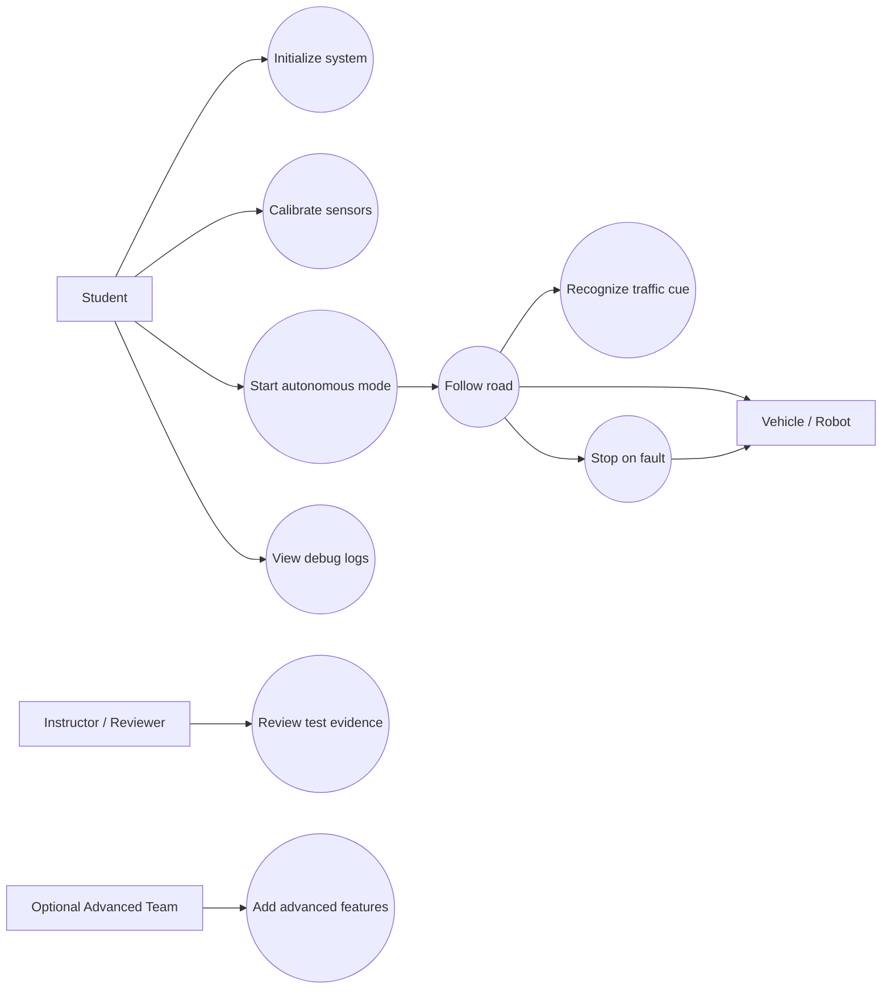
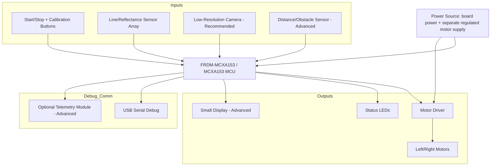

# FRDM-MCXA153 Autonomous Road-Following Car

> Documentation draft generated from Agent 0 and Agent 1 outputs.
> AI assists. Humans decide.

## 1. Introduction

This project is an autonomous, small-scale road-following vehicle built on the mandatory **NXP FRDM-MCXA153** board with the **NXP MCXA153** MCU. The vehicle follows a marked road on a controlled indoor lab track using line/reflectance sensing, and in its recommended form adds a low-resolution camera and a constrained TinyML classifier to recognize a limited set of traffic cues (such as stop and go/green-light signals) and to change behavior accordingly.

The purpose of the project is to teach embedded sensing, motor control, state machines, TinyML tradeoffs, and safe prototype autonomy on a resource-constrained microcontroller platform, in the context of an Embedded Engineering and Gen AI Summer School for third-year Computer Science students.

The starting idea, as provided by the user, was: "Autonomous Car - self-driving vehicle that uses computer vision and TinyML on a microcontroller to follow a road, recognize traffic signs and traffic lights, and navigate autonomously in a controlled environment." Agent 0 scoped this into a small controlled-track rover with three ambition tiers (core, recommended, advanced), and Agent 1 turned the recommended tier into concrete requirements, test cases, and traceability.

This project is useful for students because it connects a well-known, motivating idea (a self-driving car) to real embedded-systems constraints: GPIO, timers, PWM, ADC/I2C/SPI/UART sensor interfaces, state machines, safety fallback states, memory-constrained TinyML, and disciplined requirements/testing practice. It is useful for others (instructors, reviewers) as a repeatable, safety-conscious teaching platform with a clear human-review gate before implementation.

The FRDM-MCXA153 is the mandatory target board for all summer school projects, per explicit user constraint. It is a fixed project requirement, not an assumption, and it is not to be replaced with any other main controller.

> This documentation is a draft and must be validated by students and instructors before implementation.

## 2. General Description

### 2.1 Project Summary

- **Project name:** FRDM-MCXA153 Autonomous Road-Following Car
- **Short summary:** A small autonomous vehicle controlled by the NXP FRDM-MCXA153 that follows a controlled road track, reacts to simple traffic cues, and can scale from sensor-based line following to constrained TinyML vision classification.
- **Main objective:** Demonstrate embedded autonomy on the mandatory FRDM-MCXA153 board through motor control, road tracking, traffic cue recognition, and safe navigation in a controlled tabletop or floor environment.
- **Intended users:** Third-year university Computer Science students.
- **Operating environment:** Indoor lab track with printed or taped road lines, controlled lighting, low speed operation, and instructor-approved test zones.
- **Selected scope:** Recommended tier — sensor-assisted road following plus limited TinyML traffic cue recognition. The core line-following version must remain independently demonstrable.
- **Main behavior:** The car starts in a safe idle state, follows a marked road, slows or stops for recognized cues, responds to simple traffic lights or signs, and reports status through LEDs, serial logs, or an optional display.
- **Inputs:** Road/lane sensing (reflectance sensors, core); optional low-resolution camera (recommended/advanced); traffic light cue (colored LEDs or printed markers); traffic sign cue (printed cards/high-contrast markers); start/stop/mode/calibration button; optional distance/obstacle sensor.
- **Outputs:** Left/right motor drive commands through a motor driver; steering or differential speed control; status LEDs (idle, running, stop, error, classification state); USB serial debug logs; optional display for mode/confidence/speed/detected cue.
- **Out of scope:** Operation on public roads or around people at vehicle scale; high-speed driving; safety-critical autonomous vehicle claims; exact MCU pin assignment before hardware review; exact SDK API names before implementation review; unverified 5 V modules connected directly to MCU pins; full general-purpose computer vision comparable to embedded Linux platforms.

### 2.2 Feature Tiers

| Tier | Description | Main Features | Extra Components | Main Risks | Suitability |
|---|---|---|---|---|---|
| Core | Low-speed chassis with sensor-based road following and safe start/stop/calibration states | Two-wheel differential drive; line/reflectance road following; start/stop/calibration/fault states; PWM motor control through driver; road-lost safe stop; serial + LED debug | Chassis, dual motors, motor driver, line/reflectance sensor array, start/stop input | Motor power management; sensor calibration; vehicle runaway if faults unhandled | Suitable and realistic for third-year CS students with instructor hardware review |
| Recommended | Adds constrained camera-based TinyML traffic cue recognition on top of the core | Low-resolution camera; TinyML cue classifier (e.g., stop, go/green); confidence thresholding with fallback; behavior mapping (stop/slow/turn/continue); dataset workflow; vision debug output | Camera module; traffic cue fixtures/printed signs | Memory limits; camera integration; lighting sensitivity; inference timing vs. control loop | Ambitious but feasible if cue set and environment are tightly constrained |
| Advanced | Optional extension with richer navigation, logging, and evaluation | More cue classes with unknown class; traffic light color recognition; obstacle stop/slow; lap/route/intersection state machine; data logging; PC-side evaluation; optional telemetry/display | Distance/ToF sensor; storage or host logging path; small I2C/SPI display; telemetry module; protected battery pack | Integration complexity; timing interference; power draw; privacy/telemetry assumptions | Optional extension for teams that finish core and recommended behavior early |

### 2.3 Scenarios

| ID | Scenario | Description |
|---|---|---|
| SC-001 | Startup and setup | Student powers the board, keeps motors disabled or lifted for checks, verifies status LED, and confirms serial debug is active. |
| SC-002 | Calibration | Student calibrates line sensors or camera thresholds under current lighting before autonomous operation. |
| SC-003 | Normal road following | Vehicle follows a marked road using sensor feedback and low-speed motor commands. |
| SC-004 | User interaction | Student uses start, stop, and mode/calibration controls to manage autonomous behavior. |
| SC-005 | Sensor and input processing | Firmware samples road sensors, optional camera frames, and button states without assuming exact pins. |
| SC-006 | Actuator behavior | Firmware commands left and right motors through a motor driver and reports state through LEDs. |
| SC-007 | TinyML traffic cue handling | Recommended tier classifies a limited cue set and maps accepted detections to vehicle behavior. |
| SC-008 | Data logging and debugging | System emits serial logs for calibration values, motor commands, detections, confidence, and faults. |
| SC-009 | Advanced behavior | Optional features add obstacle detection, route state, telemetry, display, or data logging. |
| SC-010 | Error and safety handling | Vehicle enters a safe stopped state on road loss, stop input, low confidence, sensor fault, or power concern. |

### 2.4 User Stories

| ID | User Story |
|---|---|
| US-001 | As a student, I need the car to initialize predictably, so that I can test hardware without unexpected motor movement. |
| US-002 | As a student, I need to calibrate sensors, so that the vehicle can adapt to the current track and lighting. |
| US-003 | As a student, I need the car to follow a marked road, so that the core autonomous behavior is demonstrable. |
| US-004 | As a reviewer, I need visible and serial status output, so that I can understand the system state during a demonstration. |
| US-005 | As a student, I need the car to stop on fault or stop input, so that testing remains controlled. |
| US-006 | As a student, I need traffic cue recognition, so that the recommended version demonstrates TinyML-assisted decisions. |
| US-007 | As an instructor, I need evidence from tests, so that I can approve progress toward implementation. |
| US-008 | As an advanced team, I need optional logging or telemetry, so that model and navigation behavior can be reviewed after a run. |

### 2.5 Use Case Diagram



### 2.6 Hardware and Software Block Diagram



**Power flow:** Board logic is powered through the normal development power path during bring-up; motors are powered through a separate regulated motor supply via the motor driver, never directly from MCU pins. Optional camera, display, storage, sensors, and telemetry require approved voltage/current budgets before connection.

**Data/control flow:** Road sensor and camera data flow into the MCU; firmware estimates road position, classifies approved cues, applies state-machine rules, and drives the motor driver. Debug data flows to USB serial and optionally to storage, display, or telemetry.

**Compatibility concerns:** Every external signal must be verified for 3.3 V logic compatibility or level-shifted — motor driver logic inputs, camera interface signals, distance sensor echo lines, storage modules, and telemetry modules all require datasheet review.

**Protection and decoupling needs:** Motor supply decoupling, common-ground review, current limiting for LEDs, pull-up/pull-down definitions for buttons, ESD-aware handling, and reverse-polarity/battery protection where applicable.

**Datasheet checks required:** FRDM-MCXA153 pinout and electrical characteristics, motor driver logic-level and current specs, camera module interface/voltage/timing, distance sensor voltage/timing, display and telemetry module voltage/interface.

## 3. Hardware Design

### 3.1 Bill of Materials

| # | Component | Qty | Tier | Purpose | Likely Interface | Voltage / Power Notes | Risks / Checks |
|---|---:|---:|---|---|---|---|---|
| 1 | NXP FRDM-MCXA153 board (MCXA153 MCU) | 1 | Core | Main controller (mandatory) | USB/debug interface | 3.3 V logic | Confirm board pinout before wiring |
| 2 | Chassis with dual geared motors | 1 | Core | Vehicle movement/steering | Motor driver output | External motor supply, not MCU pins | Motor stall current; noise coupling |
| 3 | Motor driver module | 1 | Core | Interface MCU signals to motors | PWM-capable + GPIO-capable | 3.3 V logic input required; separate motor supply | Some drivers need 5 V logic; verify before wiring |
| 4 | Reflectance/line sensor array | TBD | Core | Road line position sensing | GPIO/ADC/I2C-capable (module-dependent) | Prefer 3.3 V-compatible module | Some arrays are 5 V; surface/lighting sensitivity |
| 5 | Start/stop button | 1 | Core | Enter autonomous mode / force safe idle | GPIO-capable with pull-up/down | 3.3 V logic assumed | Requires debounce |
| 6 | Calibration/mode button | 1 | Core | Capture thresholds / select mode | GPIO-capable | 3.3 V logic assumed | Can be replaced by serial command early on |
| 7 | Status LEDs | TBD | Core | Idle/calibration/autonomous/stop/error indication | GPIO-capable | Board LEDs or external with current limiting | None significant |
| 8 | Low-resolution camera module | TBD | Recommended | Traffic cue image capture | SPI/I2C+parallel/UART-capable (module-dependent) | Must be 3.3 V-compatible or level-shifted | Bandwidth/memory limits; SDK support unconfirmed |
| 9 | Traffic cue fixtures (printed signs / colored LED cues) | TBD | Recommended | Provide stop/go/traffic-light cues for recognition | Optical (camera-observed) | Keep LED fixtures electrically separate from car | Lighting/white-balance sensitivity |
| 10 | Distance/obstacle (ToF) sensor | TBD | Advanced | Obstacle/end-of-track detection | I2C/GPIO/ADC/timed digital (module-dependent) | Prefer 3.3 V-compatible | Some modules use 5 V echo/trigger signals |
| 11 | Small I2C/SPI display | TBD | Advanced | Show mode/cue/confidence/fault state | I2C/SPI-capable | 3.3 V-compatible or level-shifted | Optional; not required for core/recommended |
| 12 | Telemetry / external flash / microSD module | TBD | Advanced | Stream or store run data | UART/SPI/I2C-capable (module-dependent) | 3.3 V logic and power confirmed before use | Storage writes may interrupt real-time control if unbuffered |
| 13 | Battery pack + regulator (for portable operation) | TBD | Advanced | Portable power for motors/board | Regulated power path | Requires protection, regulation, instructor review | Unsafe without protection/regulation review |

### 3.2 Hardware Block Diagram Description

The FRDM-MCXA153 is the main controller for all tiers. Core hardware includes a dual-motor chassis driven through a motor driver, a line/reflectance sensor array for road position sensing, a start/stop button, a calibration/mode button, status LEDs, and a USB serial debug connection. The recommended tier adds a low-resolution camera and externally-provided traffic cue fixtures (printed signs or colored LED markers) observed optically. The advanced tier optionally adds a distance/obstacle sensor, a small display, a telemetry or storage module, and a protected battery pack for portable operation.

Sensors sample road position and (in the recommended/advanced tiers) camera images and obstacle distance. Actuation is limited to motor driver commands (PWM + direction) — motors are never driven directly from MCU pins. User inputs are two debounced buttons (start/stop, calibration/mode). UI/debug is provided by status LEDs and USB serial logs, with an optional display for the advanced tier.

All components must be verified for 3.3 V logic compatibility; 5 V modules require level shifting or must be excluded. Current/power concerns apply particularly to motors (stall current, external regulated supply required, never powered from MCU pins), the camera module (bandwidth and power draw), and any battery pack (protection and regulation required before use). Protection components needed include decoupling capacitors on the motor supply, pull-up/pull-down resistors for buttons, current-limiting resistors for LEDs, and reverse-polarity/battery protection where applicable. Required datasheet checks include the FRDM-MCXA153 pinout/electrical characteristics, motor driver logic thresholds, camera module interface and voltage, and distance sensor voltage/timing.

### 3.3 Pin Allocation Draft

| Component | Tier | Signal | Required MCU Capability | Suggested Pin / Capability | Voltage Level | Direction | Interface | Verification Needed |
|---|---|---|---|---|---|---|---|---|
| Start/stop button | Core | Button state | GPIO-capable pin with pull-up/down | Generic FRDM-MCXA153 capability only - exact pin requires board pinout and datasheet verification. | 3.3 V logic assumed | Input | GPIO | Debounce, pull configuration, active level |
| Calibration/mode button | Core/Recommended | Button state | GPIO-capable pin | Generic FRDM-MCXA153 capability only - exact pin requires board pinout and datasheet verification. | 3.3 V logic assumed | Input | GPIO | Debounce, pull configuration, active level |
| Line sensor array | Core | Road reflectance channels | ADC/GPIO/I2C-capable (module-dependent) | Generic FRDM-MCXA153 capability only - exact pin requires board pinout and datasheet verification. | 3.3 V compatible or level shifted | Input | ADC/GPIO/I2C | Signal range, sample timing, sensor supply |
| Motor driver (speed) | Core | Left/right enable or speed | PWM-capable outputs | Generic FRDM-MCXA153 capability only - exact pin requires board pinout and datasheet verification. | 3.3 V logic to driver | Output | PWM | Driver input threshold, frequency tolerance, current path |
| Motor driver (direction) | Core | Direction/control lines | GPIO-capable pins | Generic FRDM-MCXA153 capability only - exact pin requires board pinout and datasheet verification. | 3.3 V logic to driver | Output | GPIO | Driver truth table, default stopped state |
| Status LEDs | Core | State indicators | GPIO-capable pins | Generic FRDM-MCXA153 capability only - exact pin requires board pinout and datasheet verification. | 3.3 V logic assumed | Output | GPIO | Current limiting, board LED availability |
| USB serial debug | Core | Debug log stream | USB interface or debug serial path | Generic FRDM-MCXA153 capability only - exact interface requires board documentation. | Board-defined | Bidirectional | USB/UART debug | Host connection, baud/USB configuration |
| Low-resolution camera | Recommended | Image/configuration data | SPI/I2C+data/UART-capable (module-dependent) | Generic FRDM-MCXA153 capability only - exact pin requires board pinout and datasheet verification. | 3.3 V compatible or level shifted | Input/config bidirectional | Camera-specific digital interface | SDK support, frame size, timing, memory, voltage |
| Distance sensor | Advanced | Range reading | I2C/GPIO/ADC/timed digital (sensor-dependent) | Generic FRDM-MCXA153 capability only - exact pin requires board pinout and datasheet verification. | 3.3 V compatible or level shifted | Input/bidirectional | I2C/GPIO/ADC | Echo voltage, timing, update rate |
| Display | Advanced | Status display data | I2C/SPI-capable pins | Generic FRDM-MCXA153 capability only - exact pin requires board pinout and datasheet verification. | 3.3 V compatible or level shifted | Output/bidirectional | I2C/SPI | Voltage, address/chip select, update timing |
| Telemetry/storage | Advanced | Run data | UART/SPI/I2C-capable (module-dependent) | Generic FRDM-MCXA153 capability only - exact pin requires board pinout and datasheet verification. | 3.3 V compatible or level shifted | Bidirectional | UART/SPI/I2C | Power, blocking behavior, data integrity |

### 3.4 Electrical Schematics

- `TODO: Add final schematic image or link.`
- `TODO: Add motor driver wiring diagram.`
- `TODO: Add sensor connection diagram.`
- `TODO: Add power distribution diagram.`

### 3.5 Signal Diagrams and Measurements

- `TODO: Capture PWM signal (motor driver enable/speed lines) with oscilloscope or logic analyzer.`
- `TODO: Capture line/reflectance sensor signal traces under calibrated lighting.`
- `TODO: Capture serial debug output during a full startup-to-stop run.`
- `TODO: Measure power rail voltages under idle and motor-load conditions.`
- `TODO: Measure motor stall/peak current and confirm supply headroom.`
- `TODO: Perform timing analysis of control loop vs. camera/inference latency.`

## 4. Software Design

### 4.1 Development Environment

- **Recommended development environment:** NXP-supported embedded C development workflow for FRDM-MCXA153, with board configuration reviewed before implementation.
- **Recommended SDK/libraries:** NXP MCUXpresso SDK (or other NXP-supported SDK package), subject to local project setup; CMSIS-NN or a lightweight TinyML inference runtime if compatible with the chosen model/build environment; a host-side Python/notebook workflow for dataset preparation and model evaluation, if permitted; a simple serial logging tool for calibration/test runs.
- **Programming language:** C.
- **Suggested starting point:** Begin from a minimal FRDM-MCXA153 firmware project that proves GPIO, timer/PWM output, serial logging, and one sensor input before integrating motors and TinyML.

`TODO: Confirm exact development environment, SDK version, build system, and flashing/debugging workflow.`

### 4.2 Firmware Architecture

- **Architecture style:** Bare-metal superloop with interrupt-driven timing or peripheral events. RTOS use is unknown and should be approved only if it fits the course setup.
- **Reason for choice:** The project needs predictable state-machine behavior, simple scheduling, and clarity for third-year students. A superloop is sufficient for core behavior; interrupts can handle timing or capture events without inventing SDK APIs.
- **Main modules:** Platform initialization; state machine; safety manager; road sensor module; calibration module; motor control module; user input module; status LED module; serial logger; (recommended) camera acquisition module; (recommended) TinyML inference module; (advanced) obstacle/logging/display/telemetry modules.
- **Startup sequence:** Initialize board services → keep motor output disabled → initialize debug logging → verify configured inputs/outputs → enter idle/stopped state → wait for calibration or start command.
- **Main loop/task flow:** Read user inputs → update safety conditions → sample road sensors → update calibration or road estimate → process camera/inference when enabled → update state machine → command motors → update status indicators → emit logs.
- **Interrupt/event handling:** Use interrupts only for approved timing, button events, communication, or sensor events where needed. Interrupt handlers should set flags/buffers; main logic stays in the state-machine modules.
- **Communication/data logging flow:** Core logs are serial and non-blocking where possible. Advanced storage or telemetry must buffer data and avoid delaying safety checks.
- **Advanced feature flow:** Obstacle sensing, display updates, storage, telemetry, and extra route states are optional and must not override core stop behavior.
- **Error handling:** Faults include road lost, sensor unavailable, camera unavailable, low-confidence cue, motor driver disabled, and power review failure. Faults must be visible and logged.
- **Safe-state strategy:** Stopped motor command is the default on startup, stop input, road loss, active fault, unresolved cue behavior, or failed initialization.
- **Configuration constants:** Sensor thresholds, confidence threshold, class list, speed settings, timing budget, log level, and enabled feature tier. Numeric values require human approval or measured calibration.

### 4.3 Main Algorithms and Data Structures

- State machine covering idle, calibration, autonomous/running, fault/stopped states (and, in recommended/advanced, cue-classification and behavior-mapping sub-states).
- Calibration routine for line/reflectance sensor thresholds (and camera exposure/threshold settings if applicable).
- Sensor filtering/smoothing for road position estimation from line sensor readings.
- Road position estimation logic converting raw sensor channel readings into a steering correction.
- Motor control logic mapping road position estimate and cue-driven behavior to left/right PWM + direction commands.
- TinyML inference flow: image capture → preprocessing → model inference → class + confidence output.
- Confidence thresholding: classify below-threshold results as "unknown" and route to fallback behavior.
- Behavior mapping table: recognized cue class → action (stop / slow / turn / continue).
- Fault handling logic: detect road-lost, sensor-unavailable, camera-unavailable, low-confidence, driver-disabled, and power-review-failure conditions, and force the safe stopped state.
- Logging buffer/queue for non-blocking serial (and optional storage/telemetry) output.

Do not write firmware code in this document — implementation is a student task.

### 4.4 Functional Requirements Summary

| ID | Tier | Requirement | Priority | Verification | Acceptance Criterion |
|---|---|---|---|---|---|
| FR-001 | Core | Use the NXP FRDM-MCXA153 board as the main controller platform. | Must | Inspection | Hardware review identifies FRDM-MCXA153 as the only main controller. |
| FR-002 | Core | Initialize into a stopped state before enabling motor commands. | Must | Test | No motor command observed before explicit start command. |
| FR-003 | Core | Provide a calibration mode for road sensing before autonomous following. | Must | Demonstration | Serial log or LED confirms calibration entered and completed. |
| FR-004 | Core | Read road-following sensor input and estimate road position in autonomous mode. | Must | Test | Sensor values/estimated position change when vehicle is moved across the marking. |
| FR-005 | Core | Command left/right motor outputs through a motor driver to follow the marked road. | Must | Demonstration | Vehicle completes approved track segment without leaving marked path. |
| FR-006 | Core | Command stopped state and report road-lost fault if road-following input is lost. | Must | Test | Motors stop; debug output identifies road-lost condition. |
| FR-007 | Core | Stop control activation forces stop and remains stopped until new start sequence. | Must | Test | Stop input overrides autonomous behavior in every tested state. |
| FR-008 | Core | Indicate idle/calibration/autonomous/stop/fault states via LEDs or equivalent. | Must | Demonstration | Reviewer can identify each state from documented indication. |
| FR-009 | Core | Output serial debug for startup, calibration, road position, motor state, faults. | Must | Test | Captured log contains each required event type during test run. |
| FR-010 | Recommended | Capture low-resolution camera input for traffic cue processing when camera present. | Should | Test | Debug output confirms at least one captured frame or image summary. |
| FR-011 | Recommended | Classify an approved limited set of traffic signs/light states via TinyML or constrained vision. | Should | Test | Each approved class detected during controlled static/moving test. |
| FR-012 | Recommended | Below-threshold confidence treated as unknown with fallback behavior. | Should | Test | Low-confidence sample yields unknown classification + fallback action in log. |
| FR-013 | Recommended | Approved stop cue commands vehicle stop before continuing autonomous behavior. | Should | Demonstration | Vehicle stops after approved stop cue is presented. |
| FR-014 | Recommended | Approved continue/green-light cue allows road-following to continue if no fault active. | Should | Demonstration | Vehicle continues after recognized continue cue and no active fault. |
| FR-015 | Recommended | Report detected cue class, confidence category, and selected action via serial debug. | Should | Test | Log includes class, confidence category, and action per cue event. |
| FR-016 | Advanced | Could stop/slow when an approved obstacle sensor reports an obstacle. | Could | Demonstration | Vehicle changes to approved obstacle behavior when test target presented. |
| FR-017 | Advanced | Could store/stream run data (sensor readings, inference, motor commands, faults). | Could | Test | Saved/streamed run record contains all approved fields. |
| FR-018 | Advanced | Could show mode, detected cue, confidence category, and fault state on optional display. | Could | Demonstration | Display updates match serial debug state for tested events. |

*Complete requirement details (source, related user story, module, and quality checks) are available in the full requirements report at `.agents/data/requirements_report.html`.*

### 4.5 Non-Functional Requirements Summary

| ID | Tier | Category | Requirement | Metric / Threshold | Verification |
|---|---|---|---|---|---|
| NFR-001 | Core | Power | External components must be electrically compatible with board logic/current limits or use interface circuitry. | 3.3 V compatibility or documented interface circuitry; current within approved limits (TBD exact values) | Inspection and measurement |
| NFR-002 | Core | Safety | Vehicle operates only in an instructor-approved low-speed controlled test area. | Exact speed limit unresolved; must be approved before moving tests | Inspection and demonstration |
| NFR-003 | Core | Reliability | System enters stopped state for stop input, road loss, initialization, and active faults. | Stopped response observed in all listed conditions | Test |
| NFR-004 | Core | Maintainability | Firmware exposes calibration, state, and fault information through serial logs. | Logs include startup, calibration, state, and fault event classes | Test |
| NFR-005 | Recommended | Memory | TinyML model, image/tensor buffers, and application code fit the approved MCXA153 memory budget. | Exact memory budget unresolved (TBD) | Analysis |
| NFR-006 | Recommended | Timing | Camera capture and TinyML inference must not block periodic safety checks/motor updates. | Exact loop period unresolved (TBD) | Analysis and timing test |
| NFR-007 | Recommended | Usability | Documented visible/serial indicators for calibration, running, stopped, fault states. | Reviewer can map each indicator to documented state | Demonstration |
| NFR-008 | Recommended | Privacy/security | Camera datasets/logs avoid intentionally collecting identifiable people or private spaces. | Dataset review finds only track/signs/light cues/non-identifying context | Inspection |
| NFR-009 | Advanced | Power | Battery, telemetry, storage, display, and obstacle sensors added only after a reviewed power budget. | Power budget approved by human reviewer before connection | Inspection |
| NFR-010 | Advanced | Reliability | Advanced logging/telemetry must not block safety-state handling. | No missed stop/fault handling during logging test | Test |

### 4.6 Test Plan Summary

| Test ID | Requirement | Tier | Test Type | Expected Result | Evidence |
|---|---|---|---|---|---|
| TC-001 | FR-001 | Core | Inspection | Main controller is FRDM-MCXA153. | Checklist result, photo |
| TC-002 | FR-002 | Core | Test | System enters stopped state before start command. | Serial log; oscilloscope/logic analyzer capture |
| TC-003 | FR-003 | Core | Demonstration | Calibration state visible and logged. | Serial log, video |
| TC-004 | FR-004 | Core | Test | Sensor readings and estimated road position change with movement. | Serial log |
| TC-005 | FR-005 | Core | Demonstration | Vehicle follows marked road segment. | Video, serial log |
| TC-006 | FR-006 | Core | Test | Vehicle stops and reports road-lost fault. | Video, serial log |
| TC-007 | FR-007 | Core | Test | Stop command overrides current behavior in every tested state. | Video, serial log, logic capture |
| TC-008 | FR-008 | Core | Demonstration | Visible output identifies each state. | Checklist result, video |
| TC-009 | FR-009 | Core | Test | Log includes all required event classes. | Serial log |
| TC-010 | FR-010 | Recommended | Test | System reports captured frame or summary. | Serial log, optional image dump |
| TC-011 | FR-011 | Recommended | Test | System classifies each approved cue. | Serial log, photo/video evidence |
| TC-012 | FR-012 | Recommended | Test | System reports unknown and uses fallback. | Serial log, photo of cue |
| TC-013 | FR-013 | Recommended | Demonstration | Vehicle stops after recognized stop cue. | Video, serial log |
| TC-014 | FR-014 | Recommended | Demonstration | Vehicle continues road following after continue cue. | Video, serial log |
| TC-015 | FR-015 | Recommended | Test | Log includes class, confidence category, and action. | Serial log |
| TC-016 | FR-016 | Advanced | Demonstration | Vehicle slows/stops per approved obstacle behavior. | Video, serial log |
| TC-017 | FR-017 | Advanced | Test | Run record includes required fields. | Saved data log, dashboard screenshot |
| TC-018 | FR-018 | Advanced | Demonstration | Display matches debug state. | Video, serial log |

*Full preconditions, steps, and pass/fail rules are in the requirements report (`.agents/data/requirements_report.html`).*

### 4.7 Traceability Summary

| User Story | Requirement(s) | Test Case(s) | Evidence | Gap |
|---|---|---|---|---|
| US-001 | FR-001, FR-002 | TC-001, TC-002 | Checklist, photo, serial/log capture | None |
| US-002 | FR-003 | TC-003 | Serial log, video | None |
| US-003 | FR-004, FR-005 | TC-004, TC-005 | Serial log, video | None |
| US-004 | FR-008, FR-009, FR-015 | TC-008, TC-009, TC-015 | Checklist, serial log | None |
| US-005 | FR-006, FR-007 | TC-006, TC-007 | Video, serial log | None |
| US-006 | FR-010, FR-011, FR-012, FR-013, FR-014 | TC-010 through TC-014 | Serial log, photo/video evidence | Exact cue classes unresolved until human approval |
| US-007 | All Must FRs | TC-001 through TC-009 | Test report and collected evidence | None |
| US-008 | FR-016, FR-017, FR-018 | TC-016, TC-017, TC-018 | Video, logs, screenshots | Advanced components unresolved |

## 5. Risk Matrix

| ID | Category | Tier Affected | Severity | Probability | Impact | Mitigation | Human Approval Required |
|---|---|---|---|---|---|---|---|
| R-001 | Technical | Recommended | High | Medium | Camera/TinyML integration may exceed schedule | Keep line following independent; start with static cue classification; limit class count | Yes |
| R-002 | Technical | Core | Medium | Medium | Sensor calibration may fail under changed lighting/surfaces | Calibration mode; serial raw-value logging; controlled track materials | No |
| R-003 | Safety | Core | High | Medium | Vehicle may collide with equipment or people during tests | Low speed; lifted-wheel startup tests; stop input; road-lost stop; supervised test area | Yes |
| R-004 | Voltage/power | Core | High | Medium | Motor driver/sensors could damage board on wrong logic level or current path | Datasheet review; voltage measurement; level shifting; separate motor power | Yes |
| R-005 | Timing | Recommended | Medium | Medium | Inference/camera capture may delay control and stop handling | Budget timing; process vision at lower rate than safety checks; non-blocking logs | Yes |
| R-006 | Memory | Recommended | High | Medium | Model/image buffers/tensor arena/firmware may exceed memory | Low-resolution images; small model; compile-time memory report; model size review | Yes |
| R-007 | Privacy/security | Recommended | Medium | Low | Camera data could capture people or private spaces | Track-only datasets; review saved images/logs | Yes |
| R-008 | Reliability | Advanced | Medium | Low | Telemetry/display/storage may block safety logic | Optional, buffered modules disabled until core tests pass | No |
| R-009 | Advanced feature | Advanced | Medium | Medium | Too many sign classes may reduce classifier quality | Approve small cue set first; add unknown class before expanding | Yes |
| R-010 | Voltage/power | Advanced | High | Medium | Battery operation may introduce safety/brownout issues | Protected battery pack; regulator review; current measurement; instructor approval | Yes |

## 6. Assumptions and Open Questions

### 6.1 Confirmed Facts

- Project concept is an autonomous self-driving vehicle.
- Vehicle should use computer vision and TinyML on a microcontroller.
- Vehicle should follow a road.
- Vehicle should recognize traffic signs and traffic lights.
- Vehicle should navigate autonomously in a controlled environment.
- Project must use the NXP FRDM-MCXA153 board (mandatory, not an assumption).

### 6.2 AI Assumptions

- **A-001:** The vehicle will be a small tabletop or floor robot, not a road-capable vehicle. *(requires human approval)*
- **A-002:** Road following can be implemented with line or reflectance sensors in the core version. *(requires human approval)*
- **A-003:** TinyML classification will be limited to a small number of traffic signs or traffic light states. *(requires human approval)*
- **A-004:** The camera module and motor driver will be selected later based on 3.3 V logic compatibility and local availability. *(requires human approval)*
- **A-005:** The controlled environment will have consistent lighting and printed or taped road features. *(requires human approval)*
- **AI-A1-001:** The first approved build target is the recommended tier, with core features verified before TinyML integration.
- **AI-A1-002:** Initial track speed shall be limited by an instructor-approved setting; any numeric speed value remains unresolved until hardware is selected.
- **AI-A1-003:** The TinyML cue set shall start with at least stop and go/green behavior; the exact class list requires human approval.
- **AI-A1-004:** Camera data shall not intentionally include identifiable people.

### 6.3 Open Questions

| ID | Question | Why It Matters | Owner | Status |
|---|---|---|---|---|
| Q-001 | Which chassis, motors, motor driver, and power source are available? | Determines speed control method, power safety requirements, and hardware integration effort | Student / Instructor | Open |
| Q-002 | Which camera module, if any, is available and compatible with the FRDM-MCXA153 setup? | Determines camera interface, frame size, buffering, and SDK feasibility for TinyML vision | Student / Instructor | Open |
| Q-003 | How many traffic signs and traffic light states must be recognized for the demonstration? | Affects dataset size, model complexity, memory use, and testing effort | Student / Instructor | Open |
| Q-004 | Will students be allowed to train a model before the lab, or must all training support happen during the course? | TinyML model preparation can dominate schedule if not planned early | Student / Instructor | Open |
| Q-005 | What safety rules apply to moving robots in the lab? | Speed limits, test area rules, and emergency stop expectations should be requirements from the start | Student / Instructor | Open |
| Q-006 | Should traffic light recognition use camera color detection, a separate color sensor, or encoded lab fixtures? | Changes sensor selection, difficulty, and robustness | Student / Instructor | Open |

## 7. Human Review Checklist

- [ ] Scope approved
- [ ] Selected feature tier approved
- [ ] FRDM-MCXA153 confirmed as mandatory board
- [ ] FRDM-MCXA153 pinout checked
- [ ] Voltage compatibility checked
- [ ] Current limits checked
- [ ] Power budget checked
- [ ] External modules checked
- [ ] Advanced components approved or removed
- [ ] Sensor/actuator interfaces confirmed
- [ ] Firmware architecture approved
- [ ] Timing and memory constraints reviewed
- [ ] Test plan reviewed
- [ ] Traceability reviewed
- [ ] Safety/privacy/security risks reviewed
- [ ] AI assumptions accepted or rejected
- [ ] Implementation allowed to start

## 8. Obtained Results

```markdown
TODO: Complete after implementation.

Describe:
- what was implemented;
- what works;
- what does not work yet;
- measurements and test results;
- photos or screenshots;
- demo observations;
- limitations.
```

## 9. Conclusions

```markdown
TODO: Complete at the end of the project.

Discuss:
- what was learned;
- what worked well;
- what was difficult;
- what would be improved in a future version;
- how Gen AI helped or failed to help.
```

## 10. Download

```markdown
TODO: Add links or attach:
- source code archive;
- schematic files;
- build instructions;
- README;
- ChangeLog;
- test logs;
- demo video;
- final presentation.
```

## 11. Project Journal

| Date | Work Completed | Problems / Risks | Next Steps | Author |
|---|---|---|---|---|
| TODO | TODO | TODO | TODO | TODO |
| TODO | TODO | TODO | TODO | TODO |
| TODO | TODO | TODO | TODO | TODO |
| TODO | TODO | TODO | TODO | TODO |

## 12. Bibliography / Resources

### Hardware Resources

- TODO: FRDM-MCXA153 board documentation.
- TODO: MCXA153 datasheet / reference manual.
- TODO: Sensor datasheets.
- TODO: Motor driver datasheet.
- TODO: Power supply / battery documentation.

### Software Resources

- TODO: NXP MCUXpresso SDK documentation.
- TODO: CMSIS documentation, if used.
- TODO: TinyML runtime documentation, if used.
- TODO: Project repository.

### Learning Resources

- TODO: Course/lab notes.
- TODO: Tutorials or papers used.

## 13. Documentation Status

`READY FOR HUMAN REVIEW`

- The recommended scope is defined and keeps the core line-following prototype independently demonstrable.
- The mandatory NXP FRDM-MCXA153 platform is preserved as a formal requirement throughout.
- Every Must functional requirement has at least one linked test case and traceability entry.
- Exact pins, SDK APIs, numeric timing/speed/confidence thresholds, and component choices (chassis, motor driver, camera, sensors) remain unresolved (`TBD`) until human hardware review.
- Implementation should begin only after the Human Review Checklist (Section 7) is completed and safety, power, pinout, and component decisions are approved.
